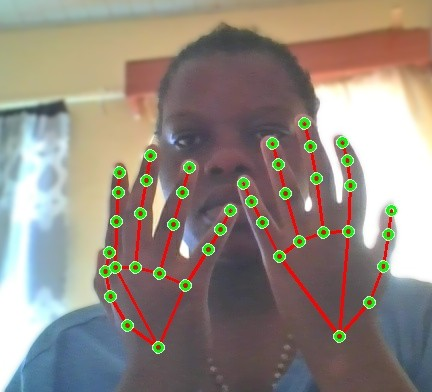

# 🖐️ Hand Detection Program

This project is a real-time hand detection system that uses computer vision and deep learning to detect and track human hands in video streams. It can be used for gesture recognition, sign language interpretation, touchless interfaces, and more.

## 📦 Features

- Real-time hand detection using webcam  input
- Detection of single or multiple hands
- Bounding box or keypoint (landmark) visualization
- Easy-to-use and extendable codebase


## 🚀 Getting Started

### Prerequisites

- Python 3.7+
- pip (Python package manager)
- OpenCV
- MediaPipe (or TensorFlow, depending on the method used)

### Installation

1. Clone this repository:

```bash
git clone https://github.com/yourusername/hand-detection.git
cd hand-detection
